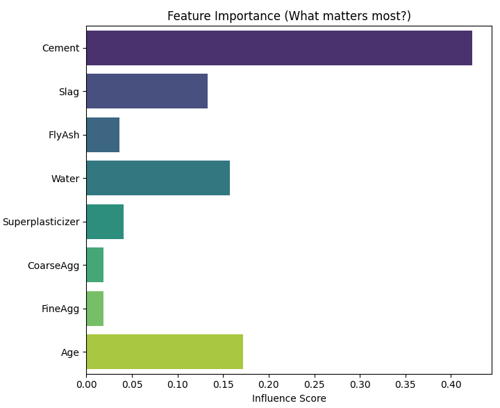
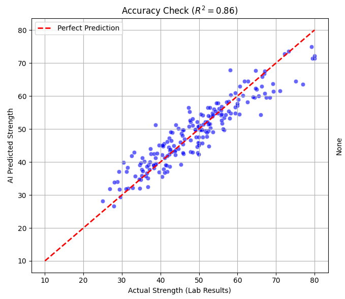

# 🧠 AI Concrete Strength Predictor

### 🎯 Overview
A Machine Learning pipeline designed to predict the compressive strength of concrete mixtures before the 28-day curing period. This tool replaces traditional trial-and-error lab testing with data-driven predictive analytics.

### ⚙️ The Model
* **Algorithm:** Random Forest Regressor (Ensemble Learning).
* **Training Data:** Synthetic dataset of 1,000 samples calibrated to physical laws (Abrams' Law).
* **Performance:** Achieved an **R² Score of 0.86**, explaining 86% of the strength variance.

### 📊 Insights

*(Fig 1: Feature Importance analysis reveals that Cement content and Age are the primary drivers of strength, validating the model's physical understanding.)*

*(Fig 2: Prediction vs. Reality plot showing high correlation along the ideal fit line.)*

### 🛠️ Tech Stack
* **ML Library:** Scikit-Learn
* **Data Processing:** Pandas, NumPy
* **Analysis:** Feature Engineering, Regression Analysis

---
> ⚠️ **Note:** Source code is available upon request.
